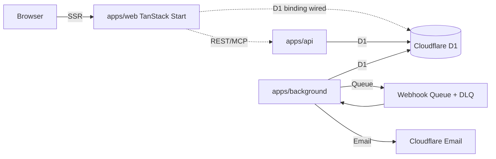

The starter is Cloudflare-first: three Workers, one shared D1 database, a Cloudflare Queue plus its dead-letter queue for outbound webhook delivery, and shared Effect backbones in `packages/capabilities` (services), `packages/api` (HttpApi contracts), and `packages/logger` (wide-event logging).

## Topology

The web Worker has the D1 binding wired but reads through `SeedLayer` today; it will swap to `makeLiveLayerFromD1` when the live readers are adopted.

## Why this shape

- **Web and API are split Workers.** The web Worker renders SSR, owns auth cookies, and runs server functions. The API Worker exposes the public REST and MCP Capability Interfaces over the same `packages/capabilities` services. Splitting them keeps the public surface independently deployable.
- **One D1 database.** Auth tables (`user`, `session`, `account`, `verification`) and starter tables (`workspaces`, `workspace_members`, `workspace_invitations`, `starter_modules`, `workspace_module_states`, `audit_events`, `notifications`, `api_tokens`, `webhook_endpoints`, `webhook_deliveries`, `integration_connections`, `implementation_reports`, `catalog_refresh_runs`) live in the same schema. There is no cross-database join story to design around.
- **Background is a separate Worker.** Cron triggers Catalog Refresh on `0 6 * * *`; the webhook queue consumer runs there too with a dead-letter queue for replay after `maxRetries`. Keeping it isolated from request-path code makes long-running operations safe.
- **`packages/capabilities` is the shared backbone.** Effect services for workspaces, Starter Modules, readiness, audit events, tokens, and webhooks live here. `packages/api` defines the matching HttpApi groups; `packages/logger` defines wide-event request scope helpers. Web, API, and background all depend on these.
