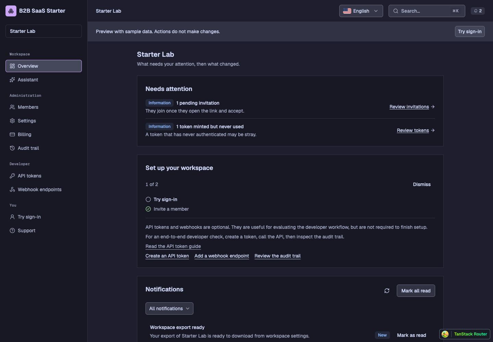
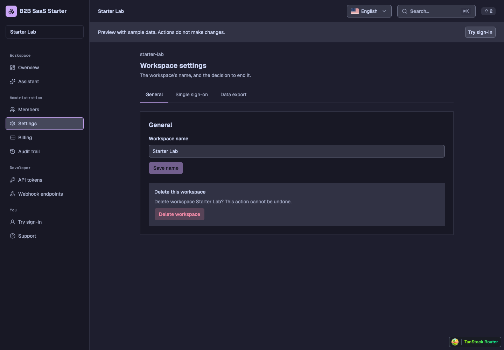
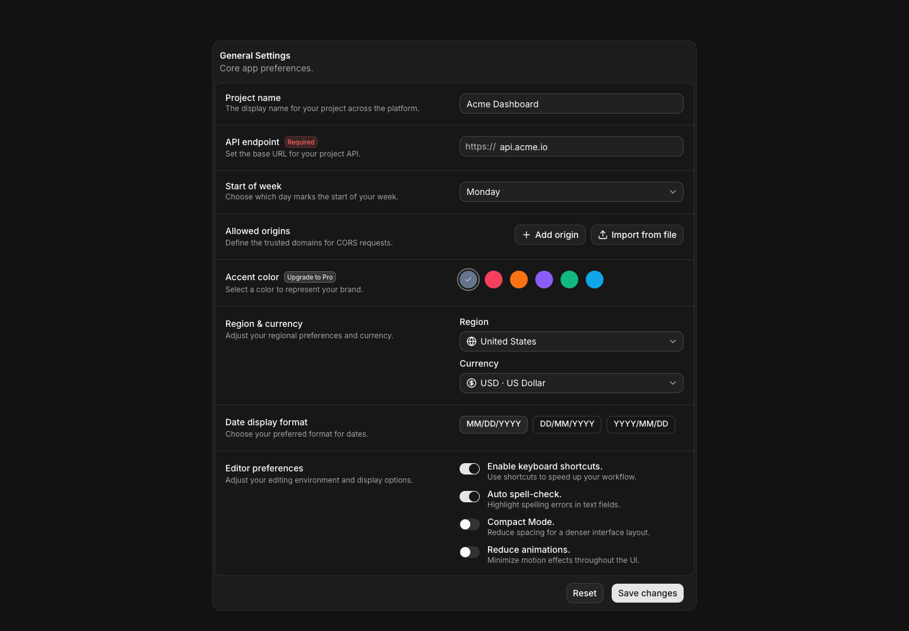
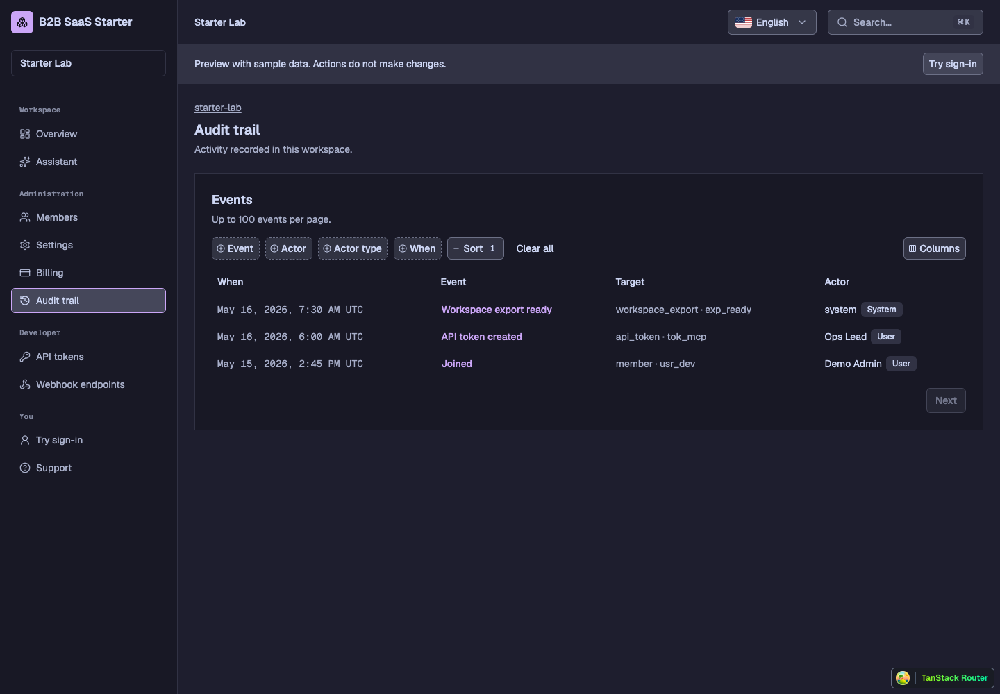
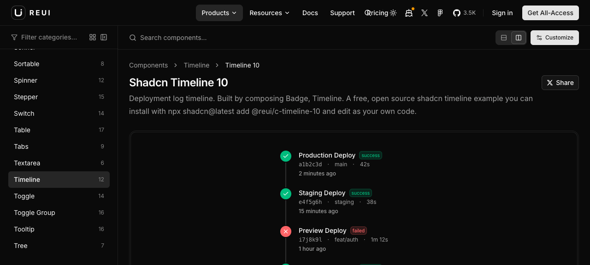
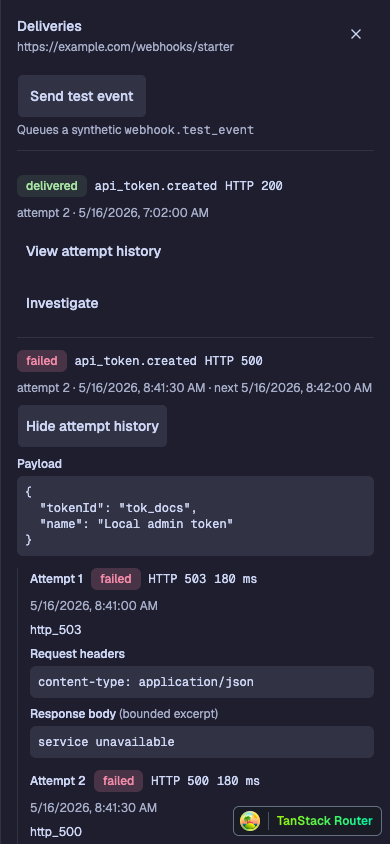
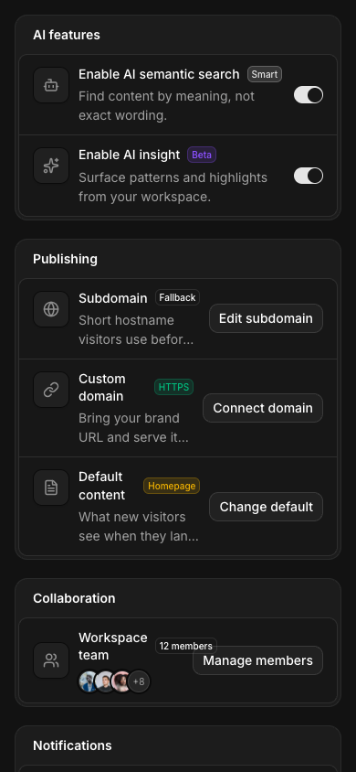

# ReUI design evaluation

Reviewed 2026-09-13 against checkout `292cb3de`. ReUI offers worthwhile design references even where this app already has the same functionality. The largest opportunity is composition: clearer hierarchy, better proportions, and less repetition across pages. Replacing the component library would miss that opportunity.

This report recommends design adaptations. It does not approve or implement a redesign. [Technical source review](reui-source-review.md) covers dependencies, source ownership and licensing separately.

## Evidence

Inspected the current checkout in an isolated preview on port 3107: overview, members and its role filter, settings, billing, audit, webhook deliveries and expanded attempt history, plus the public homepage. Desktop captures use 1440 × 1000, with some earlier component comparisons at 1280 × 577. Delivery history was also inspected at 390 × 844. Port 3071 belonged to another checkout and was excluded.

Browsed ReUI's catalog, free component examples and public block previews. Visually inspected Code Block, Data Grid, Timeline 10, App Shell 1, Settings 1, Settings 3 and Settings 15. Timeline 10 and Settings 15 were also inspected at 390 × 844. Other category recommendations below are labeled as proposals rather than tested designs. Paid source was not downloaded. These are visual judgments from representative examples, not usability measurements or an exhaustive audit of every catalog item.

## What is worth adapting

| Priority | Design improvement                        | Current app                                                                                                                                                                                             | ReUI reference and proposed adaptation                                                                                                                                                                                                                                                                                                                                                                                                                                                                                                        |
| -------- | ----------------------------------------- | ------------------------------------------------------------------------------------------------------------------------------------------------------------------------------------------------------- | --------------------------------------------------------------------------------------------------------------------------------------------------------------------------------------------------------------------------------------------------------------------------------------------------------------------------------------------------------------------------------------------------------------------------------------------------------------------------------------------------------------------------------------------- |
| 1        | Give the overview a deliberate hierarchy  | Attention, setup and notifications are similarly sized, vertically stacked panels. The long setup panel pushes notifications below the first desktop viewport.                                          | Use the compact labeled groups and aligned action rows in [Settings 15](https://reui.io/blocks/application/settings/settings-15) as a composition reference. Keep attention dominant, condense setup into a progress summary with one next action, and make notifications a quieter list. Consider a main column plus narrower setup column on wide screens. This overview layout is my proposal, not a copied ReUI dashboard.                                                                                                                |
| 1        | Make settings look like a designed form   | The General tab repeats General as a panel title. A workspace-name input spans almost the entire panel. A large filled deletion section attracts attention.                                             | Borrow the label/description column and bounded control column from [Settings 3](https://reui.io/blocks/application/settings/settings-3). Remove redundant headings. Put save feedback and the save action in a consistent footer. Give deletion a separate, quieter section with a clearly destructive action. Stack the columns on mobile.                                                                                                                                                                                                  |
| 1        | Reduce repeated page framing              | Audit has a breadcrumb, page title, subtitle, Events panel title, panel description, toolbar and table headings before the first record.                                                                | Borrow the simple table/header relationship from [Data Grid](https://reui.io/components/data-grid) and compact chrome from [App Shell 1](https://reui.io/blocks/application/app-shell/app-shell-1). Keep one page heading, put pagination information near pagination, and let filters lead directly into the table. Retain a boundary where it helps group data; remove redundant titles before removing every border.                                                                                                                       |
| 2        | Strengthen member identity and row rhythm | Member names and emails sit far apart in wide rows. Every role badge can compete with the person being identified.                                                                                      | Use the identity grouping seen in [Settings 15](https://reui.io/blocks/application/settings/settings-15) and the alignment discipline of [Data Grid](https://reui.io/components/data-grid). Group an existing avatar or initials, name and secondary email together. Align role and actions in predictable columns. Keep compact but comfortable desktop rows and 44px mobile actions. This is a local row redesign, not a reason to replace the list with a grid.                                                                            |
| 2        | Make delivery history easier to scan      | Once opened, every attempt exposes headers and response text. Attempt/status/time information competes with large blocks of evidence, especially on mobile.                                             | [Timeline 10](https://reui.io/components/timeline/c-timeline-10) uses a clear status node, event title, secondary metadata and time. Adapt that hierarchy using the app's status colors and real Attempt vocabulary. Show raw evidence on expansion per attempt. The inspected Timeline 10 itself was a static summary list; per-attempt disclosure is our addition, not verified behavior of that example.                                                                                                                                   |
| 2        | Present payloads as intentional tools     | Payload, headers and response body are plain shaded preformatted blocks with small headings.                                                                                                            | Borrow the header/body separation and discreet copy control from [Code Block](https://reui.io/components/code-block). Add a useful label, copy feedback and optional wrapping or expansion. Preserve monospace content and readable text. A small local component is enough; the full streaming/diff implementation is excessive for this task.                                                                                                                                                                                               |
| 2        | Improve billing emphasis                  | Current plan is a small badge below a generic heading. Seats and period information are quiet, while the plan tiles are large and visually similar.                                                     | ReUI's [billing catalog](https://reui.io/blocks/solutions/billing) provides plan and account-detail composition references. My proposal: lead with the actual plan name, align seats and billing period as a compact fact row, and give the current plan tile a restrained mauve border or header treatment. Align prices, entitlement rows and actions across tiles. Keep unavailable billing actions and example prices honest. This proposal is grounded in the local screenshot; individual ReUI billing blocks were not visually tested. |
| 2        | Make the shell recede                     | Workspace identity appears in the sidebar, top bar and page context. The preview notice occupies a second prominent horizontal band. The active sidebar item has a bright outline and substantial fill. | [App Shell 1](https://reui.io/blocks/application/app-shell/app-shell-1) demonstrates compact navigation and bottom utility placement. Reduce repeated identity labels, keep preview status visible but quieter, and anchor personal/support navigation toward the sidebar foot. Consider a subtle active fill with a small mauve marker. Preserve a separate, unmistakable keyboard focus ring.                                                                                                                                               |
| 3        | Refine empty and setup states             | Empty components already exist. Several states are mostly explanatory text; setup mixes progress, steps, long guidance and several equal-weight links.                                                  | Use [Empty](https://reui.io/components/empty) for concise icon/title/action grouping and [Stepper](https://reui.io/components/stepper) for progress treatment. Design a quiet progress bar or count plus compact step rows. Keep independent steps independent. A no-results state should visibly offer a reset; a first-use state should offer the permitted create action. No large illustration or forced wizard is needed.                                                                                                                |

## The visual changes that would make the biggest difference

The app already has a recognizable palette and type family. ReUI's advantage in the inspected examples is how it assigns visual weight.

Use fewer competing text weights. A page title should read first, then the row or field title, then its explanation. Many current labels, subtitles and values occupy a similar band of size and weight. Keep Geist and the current body size; reduce unnecessary semibold labels and use spacing to distinguish sections. Make secondary explanations quieter without sacrificing contrast.

Treat spacing by purpose. Use compact spacing within a record, more space between sections, and avoid large empty card interiors around one control. The member list can be denser while settings remains comfortable. The audit table is already compact; its excess space is mostly above the records, so shrinking its rows further would solve the wrong problem.

Make controls visually quieter when idle. The filled search field, language selector, preview banner and active sidebar all compete with page content. Tune those treatments in the app's semantic tokens or specific component variants. Keep input boundaries and focus states visible. This needs a rendered contrast check during implementation, not an assumed global reduction in opacity.

Reserve accent for what matters. Use mauve for the main action and current selection. Ordinary member roles need less emphasis than a selected record or primary action. Failure and success should remain legible through text and icons as well as color. ReUI's tiny badges are references for restraint, not a target text size.

## Keep the app's identity

Preserve Catppuccin Mocha, Geist, semantic status colors, square panels and the existing workspace terminology. ReUI's round double-bordered frames, icon tiles and neutral black theme are not inherently better. Borrow spacing, alignment and hierarchy without copying those treatments everywhere.

The public homepage already has a stronger individual identity than a generic component-library hero: Newsreader display type, an installation command example and a direct route to the reference app. ReUI's immediate live preview is a useful merchandising pattern. A curated view of this app close to the hero could help evaluators see what they get. Keep the current typography and factual developer pitch; do not transplant ReUI's sales copy, catalog counts or generic dashboard imagery. This is a secondary opportunity after the app pages.

## Where ReUI is not a good model

Settings 15 looked orderly on desktop, but at 390px it truncated descriptions and crowded the member action against its label. Adapt its desktop alignment and stack controls below descriptions on mobile. Do not copy the breakpoint behavior unchanged.

App Shell 1 was useful for navigation styling but its main area contained placeholders. It is not evidence of a superior dashboard content layout. Several ReUI examples have nested borders and decorative icon containers that would add clutter to this app.

Skip a generic AI chat shell for Assistant Tasks. The current task/evidence/approval distinction should remain visible. Skip calendar, Gantt, Kanban, commerce screens, avatar piles unrelated to real members, and dashboard metrics without a real data source. These may look polished but would dilute the starter's purpose.

The current table filters can remain technically intact while their layout improves. Feature parity is not a reason to preserve a weaker presentation, and visual improvement is not a reason to replace the filter engine.

## Suggested implementation order

1. Establish one page-header and content-spacing treatment using Settings and Audit. Reduce redundant headings, align settings rows and quiet the deletion section. Check desktop and mobile before applying the pattern broadly.
2. Recompose the overview: dominant attention section, compact setup, quieter notifications. Preserve all current information, but move optional explanation behind a disclosure where appropriate.
3. Refine member rows, billing emphasis and shell chrome using those same spacing and hierarchy decisions.
4. Polish delivery timelines and diagnostic blocks, then empty states.

The first pass should improve existing components and CSS. No ReUI runtime dependency is necessary. If copying source later, use identifiable MIT-covered files with notices preserved. The paid [license](https://reui.io/legal/license) restricts redistribution in public repositories and competing templates; public paid previews can inform this evaluation without importing their source. See the [source review](reui-source-review.md) for the exact MIT commit and limitations.

## Captured comparisons

Current overview: similarly weighted panels make the page feel repetitive.

Current settings: repeated heading, very wide input, prominent deletion area.

ReUI Settings 3: borrow label/control alignment and consistent action placement.

Current Audit: reduce framing above the already compact table.

ReUI Timeline 10: clear event/status/time hierarchy.

Current mobile delivery history: raw evidence dominates the scroll.

ReUI Settings 15 on mobile: truncation and crowded actions are reasons to adapt, not copy, its layout.

