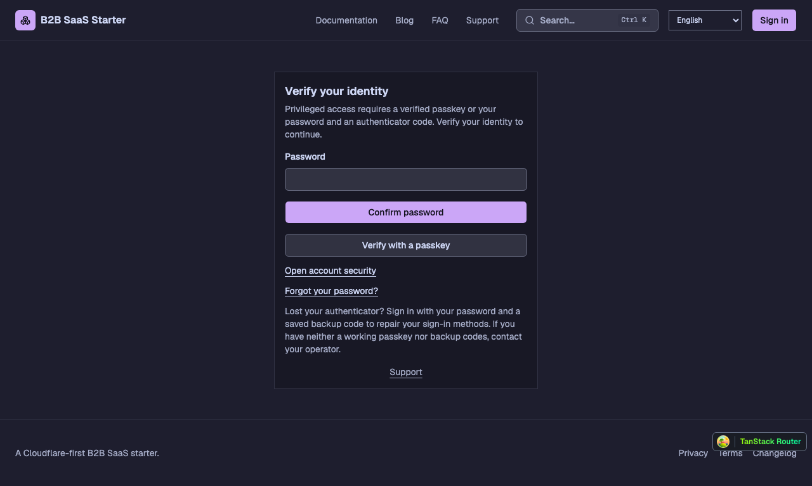

# Privileged authentication

System Admin access and Workspace owner/admin access require proof in the current session: password verification followed by verified TOTP, or a passkey authentication whose signed response has server-verified user verification. Password-only, magic-link, email-code, social and SSO sessions do not qualify by themselves. SSO-required workspaces keep their sign-in restriction; application verification is an additional step. System Admin still grants no Workspace membership bypass.

Open `/verify-authentication` to verify an existing factor. For initial enrollment, confirm the current password, open Account security and enroll TOTP or a passkey. Passkey registration does not qualify the session: authenticate with that passkey afterward. Existing users and newly promoted owners/admins can reach Account security before they qualify, but protected reads and mutations remain denied. The local demo owner follows the same rules; the member fixture does not need privileged authentication.

If social or SSO sign-in created the account without a password, use `/forgot-password` to establish one through the existing email recovery flow. Return through the required SSO sign-in, then confirm the application password and enroll a factor. Resetting a password does not grant privileged proof or remove an existing factor.

## Proof and enforcement

Better Auth hooks record evidence on the exact session created or verified by a successful ceremony. A credential's enrollment flag, client claim, remembered device or another session's proof is insufficient. The capability rereads the session, user and bound factor from D1. Expired/revoked sessions, removed factors, impersonation, recovery-only sessions and proof older than twelve hours fail closed. TOTP verification in an existing session requires password verification within five minutes. Refresh cannot renew the proof timestamp.

Web loaders, server mutations, direct auth management routes and privileged human MCP requests enforce the policy. MCP tokens carry their issuing session ID through refresh, and privileged requests check its current proof. Workspace API Tokens retain their separate machine-principal policy. Urgent session and API Token revocation remains available without completing privileged authentication.

The twelve-hour proof limit governs privileged entry. A shared recent-authentication requirement for sensitive actions remains planned. Federated assurance equivalence remains deferred.

## Recovery

A password sign-in followed by a valid, single-use backup code creates a recovery-only session capped at one hour. Refresh and intermediate session rotations preserve that deadline. Recovery can repair factors and revoke credentials; it cannot access protected Workspace or System Admin operations. Verify a replacement TOTP with the current password, or authenticate with a user-verifying passkey, to restore ordinary privileged access.

Recovery records `auth.recovery_started` against the session and submits an account-holder security email through the tracked email dispatcher. Failure to record the audit event or submit the notification revokes the recovery session. Submission is not proof of inbox delivery; operators inspect email-delivery evidence for the final outcome. Secrets and backup codes are excluded from that evidence.

There is no automatic exemption for losing every factor and backup code. Any operator-assisted identity recovery must use an explicit reviewed procedure with an expiry, audit evidence and account-holder notification; this starter does not ship an unrestricted operator bypass.

## Validation evidence

Real D1 auth tests exercise TOTP, verified and non-verifying passkeys, exact-session evidence, alternate sign-in, factor invalidation, impersonation, bounded recovery and MCP refresh. Capability tests exercise current-role/session/factor enforcement. Browser tests use real WebAuthn ceremonies with a local virtual authenticator and verify password-only denial before privileged access. These are local regression checks, not evidence of production provider configuration or certification.
